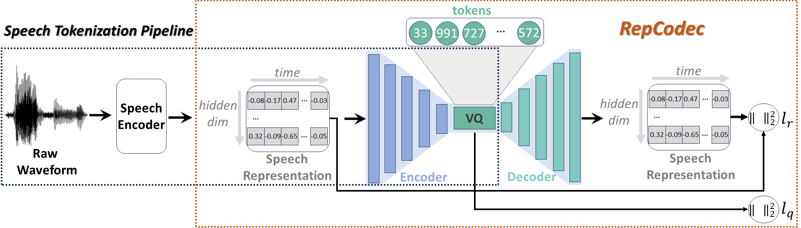

# RepCodec: A Speech Representation Codec for Speech Tokenization

> [**RepCodec: A Speech Representation Codec for Speech Tokenization**](https://arxiv.org/abs/2309.00169)

## Introduction

**RepCodec** is a speech tokenization method for converting a speech waveform into a sequence of discrete semantic
tokens.
The main idea is to train a representation codec which learns a vector quantization codebook through reconstructing the
input speech representations from speech encoders like HuBERT or data2vec.
Extensive experiments show that RepCodec significantly outperforms the widely used k-means clustering approach in both
speech understanding and generation.
Also, RepCodec generalizes well across various speech encoders and languages.



## RepCodec Models

| Feature Type                                                                                                          | Speech Data                                              | RepCodec Model                                                                                           |
|-----------------------------------------------------------------------------------------------------------------------|----------------------------------------------------------|----------------------------------------------------------------------------------------------------------|
| [HuBERT base](https://github.com/facebookresearch/fairseq/tree/main/examples/hubert#pre-trained-and-fine-tuned-asr-models) layer 9     | [Librispeech](http://www.openslr.org/12) train-clean-100 | [hubert_base_l9](https://drive.google.com/file/d/1XD0HKl607FFjri2-VJT7lHQeSpxsCCFO/view?usp=sharing)     |
| [HuBERT large](https://github.com/facebookresearch/fairseq/tree/main/examples/hubert#pre-trained-and-fine-tuned-asr-models) layer 18   | [Librispeech](http://www.openslr.org/12) train-clean-100 | [hubert_large_l18](https://drive.google.com/file/d/1mTbm5GeJ7gp_5L3QLP-JGXdf8RnRw5n6/view?usp=sharing)   |
| [data2vec base](https://github.com/facebookresearch/fairseq/blob/main/examples/data2vec/README.md#speech-2) layer 6   | [Librispeech](http://www.openslr.org/12) train-clean-100 | [data2vec_base_l6](https://drive.google.com/file/d/1d8sf3Ko_fYM9zlaiwxK_4xusLRKV5EMd/view?usp=sharing)   |
| [data2vec large](https://github.com/facebookresearch/fairseq/blob/main/examples/data2vec/README.md#speech-2) layer 18 | [Librispeech](http://www.openslr.org/12) train-clean-100 | [data2vec_large_l18](https://drive.google.com/file/d/1nuRIHaejT-uVi4cluftbT8o_JZqar5SU/view?usp=sharing) |
| [Whisper medium](https://github.com/openai/whisper/tree/main#available-models-and-languages) layer 24                 | [Librispeech](http://www.openslr.org/12) train-clean-100 | [whisper_medium_l24](https://drive.google.com/file/d/1V6YJSA2V4iywXrecJAN0oqsa3aHowexZ/view?usp=sharing) |
| [Whisper large-v2](https://github.com/openai/whisper/tree/main#available-models-and-languages) layer 32                                                                                         | [Librispeech](http://www.openslr.org/12) train-clean-100 | [whisper_large_l32](https://drive.google.com/file/d/1k_X7ZMPg8iOeDrIJe70v6CHfFygzufXC/view?usp=sharing)  |

## Speech Tokenization Using Pre-Trained Models

### Installation

Please first install RepCodec by

```
git clone https://github.com/mct10/RepCodec.git
cd RepCodec
pip install .
```

We used Python 3.9.18 and PyTorch 1.12.1 to test the usage, but the code should be compatible with other recent Python
and PyTorch versions.

### Representation Preparation

We adapt the `dump_hubert_feature.py` script
from [fairseq](https://github.com/facebookresearch/fairseq/tree/main/examples/hubert/simple_kmeans#hubert-feature)
to support dumping representations from **data2vec**, **HuBERT**, or **Whisper** encoders.

If you use our script (`examples/dump_feature.py`), please also install the following packages:

```
pip install npy_append_array soundfile 
```

Additionally, if you want to dump representations from

- **data2vec** or **HuBERT**: please
  follow [fairseq's instruction](https://github.com/facebookresearch/fairseq#requirements-and-installation) to install
  the latest fairseq.

- **Whisper**: please follow [Whispers'instruction](https://github.com/openai/whisper/tree/main#setup) to install the
  latest
  Whisper.

Then, you can follow the given examples to dump representations:

```
# Example 1: dump from HuBERT base layer 9 
# (for data2vec, simply change "model_type" to data2vec and "ckpt_path" to the path of data2vec model)

layer=9

python3 examples/dump_feature.py \
    --model_type hubert \
    --tsv_path /path/to/tsv/file \
    --ckpt_path /path/to/HuBERT/model  \
    --layer ${layer} \
    --feat_dir /dir/to/save/representations


# Example 2: dump from Whisper medium layer 24

layer=24

python3 examples/dump_feature.py \
    --model_type whisper \
    --tsv_path /path/to/tsv/file \
    --whisper_root /directory/to/save/whisper/model \
    --whisper_name medium \
    --layer ${layer} \
    --feat_dir /dir/to/save/representations
```

Explanations about the args:

- **model_type:** choose from `data2vec`, `hubert`, and `whisper`.

- **tsv_path:** path of the tsv file.
  Should have the format of

```
/dir/to/dataset
path_of_utterance_1 number_of_frames
path_of_utterance_2 number_of_frames
```

You can follow [this script](https://github.com/facebookresearch/fairseq/blob/main/examples/wav2vec/wav2vec_manifest.py)
to generate the tsv file.

For example, by running

```
python wav2vec_manifest.py \
  /dir/to/LibriSpeech/dev-clean \
  --dest /dir/to/manifest \
  --ext flac \
  --valid-percent 0
```

you can obtain the `dev-clean.tsv` in `/dir/to/manifest` for LibriSpeech. (By default, the output file name
is `train.tsv`. Remember to rename the file.)

It should be similar to:

```
/dir/to/LibriSpeech/dev-clean
2277/149896/2277-149896-0026.flac	78720
2277/149896/2277-149896-0005.flac	89600
2277/149896/2277-149896-0033.flac	45520
```

- **ckpt_path**:
  must provide for data2vec and HuBERT.
  You need to download the model
  from [data2vec website](https://github.com/facebookresearch/fairseq/blob/main/examples/data2vec/README.md#speech-2)
  or [HuBERT website](https://github.com/facebookresearch/fairseq/tree/main/examples/hubert#pre-trained-and-fine-tuned-asr-models)
  yourself.
  `--ckpt_path` is the path of the data2vec/HuBERT model.
- **whisper_root** and  **whisper_name**:
  must provide **BOTH** `--whisper_root` and `--whisper_name` for Whisper.
  If there is no corresponding model in `--whisper_root`, the script will download for you.

- **layer**:
  which Transformer encoder layer of the model should the representations be extracted from.
  It is **1-based**.
  For example, if layer=9, then the outputs from the 9<sup>th</sup> Transformer encoder layer are dumped.
  Range: [1, number of Transformer encoder layers]

- **feat_dir**: The output representations will be saved to `${feat_dir}/0_1.npy`
  and `${feat_dir}/0_1.len`.

For other useful functionalities (e.g., sharding), please check the argument list in `examples/dump_feature.py`.

### Command Line Usage

We expect to have `${feat_dir}/0_1.npy` and `${feat_dir}/0_1.len` in the provided
directory `/dir/to/representaitons`.

Also, the tsv file should be the **same** as the one used in [Representation Preparation](#representation-preparation).

```
repcodec /dir/to/representaitons \
    --model /path/to/repcodec/model \
    --tsv_path /path/to/tsv/file \
    [--model_config_path /path/to/train/config] \
    [--use_gpu] \
    [--out_dir /path/to/output]
```

If you trained the model yourself following [Training New RepCodec Models](#training-new-repcodec-models), 
please provide the training config file using `--model_config_path`.
If you use the model we provide [here](#repcodec-models), then you do not have to provide that.

This command will tokenize the representations and the output discrete tokens will be saved to `${out_dir}/tokens`.
The tokens are in the same order as the provided tsv file.

An example of the output file:

```
/dir/to/LibriSpeech/dev-clean
2277/149896/2277-149896-0026.flac	696 696 198 198 198 498 ...
2277/149896/2277-149896-0005.flac	696 696 198 198 198 907 ...
2277/149896/2277-149896-0033.flac	696 696 198 198 198 696 ...
```

Under `examples/tokens`, we provide some token files as references. They are obtained from LibriSpeech dev-clean subset
using the 6 types of representations and corresponding [RepCodec Models](#repcodec-models).
Your results should be very similar to ours.

### Python Usage

```python
import torch
import yaml

from repcodec.RepCodec import RepCodec

# for feature types of HubERT base & data2vec base, please use repcodec_dim768.yaml;
# for feature types of HuBERT large & data2vec large & Whisper medium, please use repcodec_dim1024.yaml;
# for feature types of Whisper large-v2, please use repcodec_dim1280.yaml
config = "repcodec/configs/repcodec_dim768.yaml"
with open(config) as fp:
    conf = yaml.load(fp, Loader=yaml.FullLoader)

model = RepCodec(**conf)
model.load_state_dict(torch.load("./hubert_base_l9.pkl", map_location="cpu")["model"]["repcodec"])
model.quantizer.initial()
model.eval()

# input shape: (batch size, hidden dim, sequence length)
random_features = torch.randn(size=(1, 768, 100))
with torch.no_grad():
    x = model.encoder(random_features)
    z = model.projector(x)
    _, idx = model.quantizer.codebook.forward_index(z.transpose(2, 1))
    tokens = idx.cpu().data.numpy().tolist()[0]
```

## Training New RepCodec Models

We use a config file to set up all the training configurations, e.g., data, model architecture,
optimizer, scheduler. 
We provide an example [here](./train_configs/ex_dim768_mse.yaml).

Please first install required packages following [Installation](#installation) 
and prepare the representations following [Representation Preparation](#representation-preparation). 

The input data directory is expected to have the following structure
```
/dir/to/representations/
  train_set_name/
    0_1.npy
    0_1.len
  valid_set_name/
    0_1.npy
    0_1.len
  test_set_name/
    0_1.npy
    0_1.len
```

The names of subsets should be the same as the fields in the config file.

Then, you can run training by
```
python train.py \
  -c /path/to/config/file \
  --tag $tag \
  --exp_root exp
```

`tag` is the name of the output folder.
All outputs will be saved to `exp_root/tag/`.

## Acknowledge

Our implementation is based on [facebookresearch/AudioDec](https://github.com/facebookresearch/AudioDec).
We thank them for open-sourcing their code!

## Citation

If you find our work useful, please cite the following article.

```
@misc{huang2023repcodec,
      title={RepCodec: A Speech Representation Codec for Speech Tokenization}, 
      author={Zhichao Huang and Chutong Meng and Tom Ko},
      year={2023},
      eprint={2309.00169},
      archivePrefix={arXiv},
      primaryClass={eess.AS}
}
```
